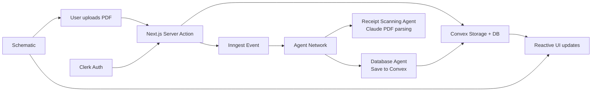

# Expensio — AI Receipt Tracker

> Full-stack SaaS demo that turns PDF receipts into structured expense data using a multi-agent AI pipeline, real-time storage, and subscription-aware feature gating.

[](https://nextjs.org/)
[](https://react.dev/)
[](https://www.typescriptlang.org/)
[](https://convex.dev/)
[](https://www.inngest.com/)

**Live demo:** [Add your deployed URL]  
**Author:** [Your Name] · [Portfolio](https://) · [LinkedIn](https://) · [Email](mailto:)

---

## Why this project exists

Manual receipt tracking is slow, error-prone, and hard to scale. Expensio demonstrates how to build a production-style AI product that:

- Accepts PDF uploads via drag-and-drop
- Extracts merchant, transaction, and line-item data with LLMs
- Persists results in a real-time database
- Enforces usage limits and premium features per plan

This repo is designed to showcase **full-stack**, **AI agent**, and **SaaS** engineering—not a starter template.

---

## Highlights (what reviewers should notice)

| Area | What I built |
|------|----------------|
| **AI agents** | Multi-agent workflow with Inngest Agent Kit: a scanning agent (Claude document parsing) and a database agent (structured persistence) coordinated via a custom router |
| **Backend** | Convex for schema, file storage, queries/mutations, and reactive UI updates |
| **Auth** | Clerk authentication integrated with Convex JWT validation |
| **Async processing** | Inngest durable functions triggered on upload; non-blocking extraction pipeline |
| **Monetization** | Schematic entitlements for scan limits + feature flags (e.g. AI summaries on Pro) |
| **Frontend** | Next.js App Router, Server Actions, Tailwind UI, drag-and-drop uploads (`@dnd-kit`) |
| **Type safety** | End-to-end TypeScript; Zod-validated agent tool parameters |

---

## Features

- **PDF upload** — Drag-and-drop or file picker; files stored in Convex storage
- **AI extraction** — Merchant info, dates, totals, currency, and itemized line items
- **AI summaries** — Human-readable receipt summaries (gated behind Pro via Schematic)
- **Receipt dashboard** — Real-time list with processing status (`pending` → `processed`)
- **Receipt detail view** — Structured data, item table, PDF preview/download, delete
- **Usage limits** — Scan quotas enforced per subscription tier
- **Pricing tiers** — Free / Starter / Pro plans with plan management portal

---

## Architecture



**Flow:**

1. User uploads a PDF (authenticated via Clerk).
2. Server Action stores the file in Convex and creates a `pending` receipt record.
3. Inngest triggers a multi-agent job with the signed PDF URL.
4. **Receipt Scanning Agent** extracts structured JSON from the document.
5. **Database Agent** writes extracted fields back to Convex and tracks usage in Schematic.
6. UI updates in real time via Convex subscriptions.

---

## Tech stack

**Frontend**

- Next.js 15 (App Router) · React 19 · TypeScript
- Tailwind CSS · shadcn/ui-style components · Lucide icons

**Backend & data**

- [Convex](https://convex.dev/) — database, file storage, server functions
- [Clerk](https://clerk.com/) — authentication

**AI & workflows**

- [Inngest](https://www.inngest.com/) + [Agent Kit](https://www.inngest.com/docs/agent-kit) — durable agent orchestration
- Anthropic Claude (document parsing) · OpenAI GPT-4o-mini (agent reasoning)

**SaaS infrastructure**

- [Schematic](https://schematichq.com/) — entitlements, feature flags, customer portal

---

## Skills demonstrated

- Designing **multi-agent systems** with specialized tools and termination logic
- Building **async AI pipelines** that don't block the upload UX
- Integrating **LLM document understanding** (PDF → structured JSON)
- Implementing **real-time full-stack apps** with Convex + React
- Applying **auth-aware** server actions and resource ownership checks
- Shipping **subscription-aware** product features (limits, gated UI)
- Writing maintainable **TypeScript** across frontend, backend, and agents

---

## Screenshots

> Add 2–3 screenshots or a short GIF for GitHub (landing page, receipt list, extracted detail view).

| Landing | Receipt detail |
|---------|----------------|
|  |  |

---

## Getting started

### Prerequisites

- Node.js 18+
- Accounts for [Convex](https://convex.dev), [Clerk](https://clerk.com), [Inngest](https://www.inngest.com), [Schematic](https://schematichq.com), and API keys for Anthropic/OpenAI

### Install & run

```bash
git clone https://github.com/YOUR_USERNAME/receipt-tracker-ai-agent.git
cd receipt-tracker-ai-agent
npm install
npm run dev
```

This starts Next.js and Convex in parallel.

### Environment variables

Create `.env.local`:

```env
# Convex
NEXT_PUBLIC_CONVEX_URL=

# Clerk
NEXT_PUBLIC_CLERK_PUBLISHABLE_KEY=
CLERK_SECRET_KEY=
CLERK_JWT_ISSUER_DOMAIN=

# Schematic
NEXT_PUBLIC_SCHEMATIC_KEY=
SCHEMATIC_API_KEY=
NEXT_PUBLIC_SCHEMATIC_CUSTOMER_PORTAL_COMPONENT_ID=

# Inngest
INNGEST_EVENT_KEY=
INNGEST_SIGNING_KEY=

# AI providers (used by Inngest agents)
ANTHROPIC_API_KEY=
OPENAI_API_KEY=
```

**Clerk + Convex:** Follow the [Convex Clerk auth guide](https://docs.convex.dev/auth/clerk) and configure `convex/auth.config.ts` with your JWT issuer domain.

---

## Project structure

```
├── app/                    # Next.js App Router pages
├── actions/                # Server Actions (upload, delete, download)
├── components/             # UI (PDFDropZone, ReceiptList, pricing)
├── convex/                 # Schema, queries, mutations, file storage
├── inngest/
│   ├── agent.ts            # Agent network + Inngest function
│   └── agents/             # Scanning & database agents + tools
└── lib/                    # Convex HTTP client, Schematic, helpers
```

---

## Roadmap

- [ ] Add database indexes for user-scoped receipt queries
- [ ] Harden delete mutation auth checks
- [ ] Expense analytics dashboard
- [ ] Export to CSV / accounting integrations

---

## License

MIT

---

Built by **[Your Name]** — open to opportunities in full-stack and AI engineering.
